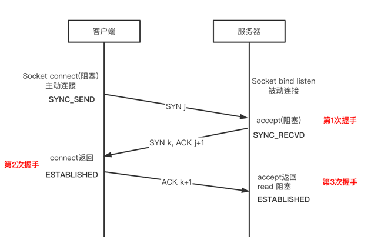
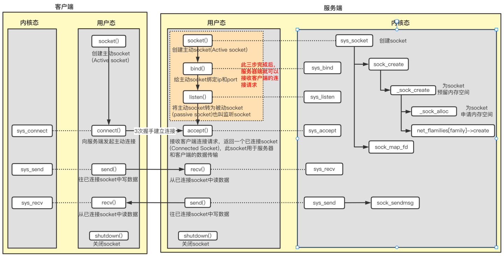
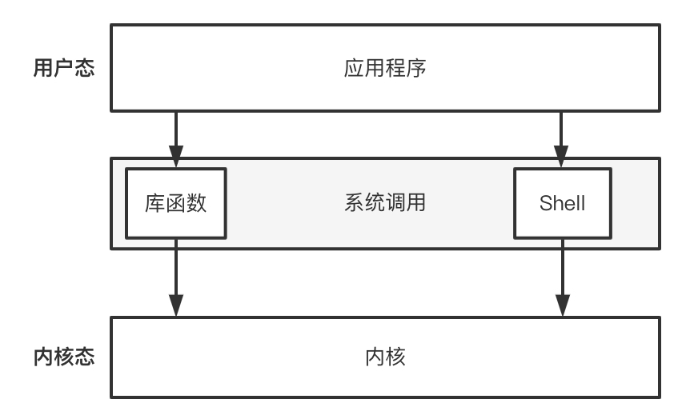

你好，我是Weiki，欢迎来到猿java。

TCP 的3次握手和4次挥手是一个老生常谈的知识点，网上关于这方面的资料铺天盖地，为什么还要炒剩饭？

但是很多人依然会有很多困惑：

- 为什么握手需要3次挥手却需要4次？
- 如果3次握手有一次掉了会怎么办？
- 如果4次挥手有一次掉了会怎们办？
- ......

这篇文章，我们就来把这些问题聊清楚。

## 3次握手

关于 3次握手，我们给出了2 张完整交互图：

第1次握手：客户端和服务器在建立Socket连接之后，客户端向服务器发送了网络包，服务器成功接收。证明客户端发送能力正常，服务器接收能力正常。

第2次握手：服务器响应客户端的网络包，客户端成功接收。证明 服务器的接收和发送能力正常，客户端接收能力正常。

## 课程免费获取

1. 添加微信：MrWeiki，备注：Redis6

2. 关注公众号：猿java， 回复：Redis6

