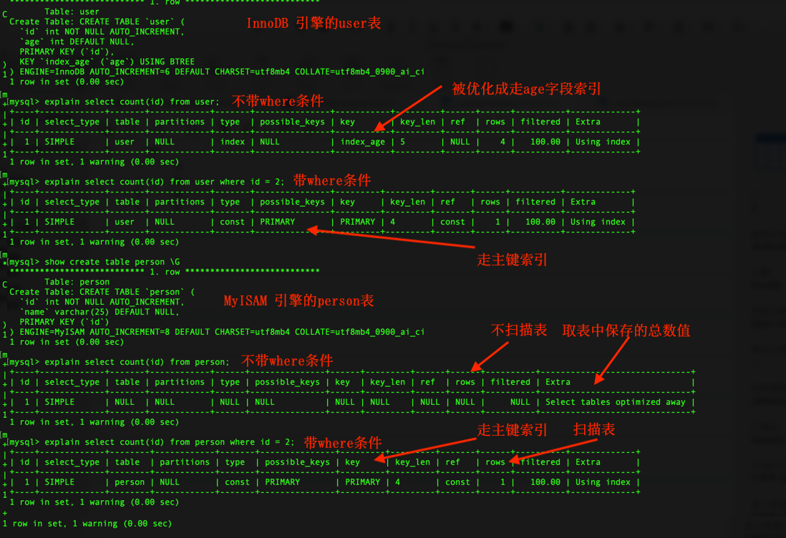

Hello 大家好，我是猿java。

在实际开发工作中，难免会使用到 MySQL 的 count(expr) 函数进行统计操作，但是，对于count(1)、count(*)、count(常量)、count(主键)、count(非主键)、count(distinct(字段)) 等多个函数，很多开发人员因为缺乏原理性的了解，往往会比较困惑选择哪一种，特别是在加 where 条件时，更加担心会不会造成性能问题，今天我们就来聊聊这些 count(expr) 函数背后的实现原理以及它们的执行效率，帮你胸有成竹的选择合适具体函数。

> 申明：本文基于 MySQL 8.0.30，数据库引擎为 InnoDB引擎 和 MyISAM引擎；
>
> 本文的count(expr)操作都是基于不加 where条件
>
> 如果需要mac本地安装 MySQL，参考：[macOS M1 源码安装 MySQL8 版本](https://www.yuanjava.cn/posts/mac-mysql8/)

## 背景

count(expr) 是 MySQL 的一个聚合函数，函数接收一个 expr 表达式，expr 表达式可以是 NULL、可以是列名，可以是常量，其他任意表达式都可以，它有 2个重要的作用：统计某个列值的数量以及统计表行数。在统计列数量时只统计列值不为 NULL 的总数，统计表总行数时不做限制。
为了更好地展开本文的讲解，需要先创建 user 和 person 两张表，user 表使用 InnoDB 引擎，person 表使用 MyISAM 引擎，表创建完成后，查看它们在磁盘上的文件信息对比，具体对比如下截图：

从上述截图可以看出：

在使用 MyISAM引擎的 person表中，表定义，数据，索引是分三个文件存储，如下：

- person_365.sdi，存储 person表定义，sdi（**S**erialized **D**ictionary **I**nformation，序列化字典信息），MySQL 8.0引入，以前的版本是
  .frm；
- person.MYD，存储 person表数据，MYD（**My**ISAM **D**ata）；
- person.MYI，存储 person表索引，MYI（**My**ISAM **I**ndex）；

在使用 InnoDB引擎的 user表中，表定义，数据，索引都存放在一个文件中，如下：

- user.ibd，ibd（**i**nnod**b** **d**ata）

接下来正式分析各个count(expr)操作

## count(*)

对于 MyISAM 引擎，会把表的总行数存在了磁盘上（存放在 information_schema 库中的 PARTITIONS 表中），在不加 where 条件时，执行 count(*) 时会直接返回这个总数，因此效率很高，但是在加 where 限定语句的时候 MySQL 需要对全表进行检索从而得出 count 的总数。
而 InnoDB 引擎并没有像 MyISAM 那样把表的总行数存储在磁盘，而是在执行 count(* )时，在不加 where 限定语句时，MySQL Server 层需要把数据从引擎里面读出来，然后逐行累加得出总数；如果加了 where 限定语句，需要根据 where 条件从引擎里面筛选出数据，然后累加得出总数。
下图展示了 MyISAM 引擎磁盘存储数据总行数：

为了更好地理解两种引擎中 count(*)的差异，我们可以比较count(*) 在 user 表和 person 表 中的执行计划，结果如图：

从上述执行计划的截图可以看出：

- InnoDB 引擎执行计划显示 rows = 2（全表只有 2 行数据），说明需要扫描全表，Extra 里面的内容是 "Using index"，说明该 count( )
  操作使用了索引（主键索引）。

- MyISAM 引擎执行计划显示 rows = NULL，说明不需要扫描表，Extra 里面的内容是 "Select tables optimized away"，它的意思是：MyISAM
  表以单独的行数存储总数，执行 count 查询时，MySQL 不需要查看任何表行数据，而是将预先计算的行数立即返回。

那么，为什么 InnoDB引擎不能像 MyISAM引擎一样，把表的数据总数存起来，而是需要扫描全表呢？

这是因为 InnoDB引擎可以支持事务，默认的隔离级别是 Repeatable
Read（可重复读，指的是一个事务执行过程无法看到其它事务未提交的数据），而可重复读又是通过多版本并发控制（MVCC）来实现的，MVCC更直白的表述是：一行记录在不同的事务中表现的结果值是不一样的，呈现出一行记录多种版本数据。
关于 MVCC可以参照下面的图来理解：

为了更好地说明 InnoDB 引擎为什么不把数据总行数存磁盘，这里通过一个案例进行解析：假设有两个事务 sessionA，sessionB

- sessionA 先启动一个事务，然后 select count(*) from user 统计总行数；
- sessionB 也启动事务，先执行一次 select count(*) from user，然后插入一行数据，再 select count(*) from user，统计总行数；

执行顺序流以及截图如下：

| sessionA                                             | sessionB                                          |
|------------------------------------------------------|---------------------------------------------------|
| #开启事务   begin;                                    |                                                   |
| select count(*) from user; |                                                   |
|                                                      | select count(*) from user;                        |
|                                                      | #插入一条数据 insert into user(id,age) values(3,30); |
| select count(*) from user;                  | select count(*) from user;                        |

通过运行结果截图，我们可以看出，sessionB 新增一条记录后，在未 commit 提交事务前，sessionA 的 count(*) 操作并没有把这条数据统计进去，符合可重复读隔离级别的要求，假如 InnoDB 也像 MyISAM 一样把行的总数存在磁盘上，那么 sessionA 和 sessionB 的 count(*) 结果值相同，也就是说 sessionA 和 sessionB 最后一次 count(*) 的结果值都是 3，这显然就违背了可重复读隔离级别的要求。

所以，通过该案例的分析也刚好验证了上述 explain count(*) 的执行计划，InnoDB引擎需要全表扫描。

**有人说，在使用 InnoDB 引擎的 user表上执行 "show table status" 指令，结果中的 ROWS 字段就是表的总行数，快捷方便，效率高。那么，可行吗？**

方法是否有效，我们还是用事实说话，我们可以执行"show table status"指令，执行顺序流和结果截图如下：

| sessionA                   | sessionB                                          |
|----------------------------|---------------------------------------------------|
| #开启事务   begin;          |     #开启事务   begin;                                              |
| select count(*) from user; |                                                   |
|                            | select count(*) from user;                        |
|                            | #插入一条数据 insert into user(id,age) values(3,30); |
| select count(*) from user; | select count(*) from user;                        |
| show table status\G        | show table status\G                               |

通过运行结果截图可以看出，sessionA的 count(*)结果和 "show table status"指令结果中的 ROWS值相等，但是在
sessionB中两个值就不一样，因此说，通过 "show table status"来统计总数，结果值是不准确的。

按照 MySQL官方的说法： "show table status"命令显示行数的误差率在 40% ~ 50%。

> show table status 查询的是系统 information_schema 库中的 TABLES
> 表，关于表字段可以参考官方文档：[TABLES 官方文档](https://docs.oracle.com/cd/E17952_01/mysql-8.0-en/information-schema-partitions-table.html)

需要说明的是：尽管 InnoDB引擎的 count( * )操作需要扫描全表，但是 MySQL还是有做过优化处理，具体优化如下：

因为
InnoDB引擎采用的是聚簇索引机制，主键索引的叶子节点存放了数据，而普通索引的叶子节点存放的是主键值。因此，不管遍历哪一棵索引树，count(
* )的结果都是一致的，所以，MySQL优化器会找到最小的那棵索引树进行遍历，这样尽管扫描的行数没有减少，但是针对每行记录获取的数据量减少了，因此性能就提升了。

有了上述对 count( * )的讲解，我们分析和理解其他几种 count(expr)操作就会轻松很多，在 InnoDB引擎中，count(expr)
是一个聚合函数，对于引擎返回的结果集，MySQL Server会逐行判断，count(参数)函数最终就是统计"参数不是 NULL"的总数作为结果值。

## count(主键)

count(主键)的执行逻辑为：InnoDB引擎会遍历整张表，然后取出每一行的主键值并返回给 MySQL Server层，Server层拿到引擎的结果值后，统计主键总数量。

## count(1)

count(1)的执行逻辑为：InnoDB引擎遍历整张表，但是不会取数据值，MySQL Server层对于引擎返回的每一行记录都放置一个数字“1”，最终再统计包含
1的总行数。

所以，count(1)操作要比 count(主键)快。因为count(主键)需要从引擎返回主键值，过程中会涉及到数据行的解析，字段值的拷贝等I/O操作。

## count(非主键字段)

count(非主键字段)操作有些特殊，我们先看一张截图：

如上述截图：

InnoDB引擎的 user表中最开始有 3条数据，然后执行 insert into user(id,age) values (4,NULL); 插入一条
age=NULL的数据，各种count(expr)的结果为：

- count(*) = 4；
- count(1) = 4；
- count(id) = 4;
- count(age) = 3;

MyISAM引擎的 person表中最开始有 3条数据，然后执行 insert into person(id,name) values (4,NULL); 插入一条
name=NULL的数据，各种count(expr)的结果为：

- count(*) = 4；
- count(1) = 4；
- count(id) = 4;
- count(name) = 3;

从结果可以发现，不管是使用了InnoDB 引擎的user，还是使用了 MyISAM引擎的 person表，通过 count(非主键)方式进行统计时，表的总行数就会比其他几种 count(expr)方式少 1 条，为什么呢？

**这是因为：count(非主键) 只统计非主键字段值不为NULL的总数。**

## 源码分析

## 总结

count(expr)函数的参数 expr可以是任意表达式，该函数用于统计在符合搜索条件的记录总数；

通过上面的对比和分析，我们可以得出 count(expr)函数按照执行效率从低到高依次排序为：

count(非主键字段) < count(主键) < count(1) ≈ count( * )

因此，count(1) 或者 count( * )的效率最高。对于这两种方式的选择，建议尽量使用 count( * )，因为
MySQL优化器会选择最小的索引树进行统计，我们把这个优化的问题交给 MySQL优化器去解决。

count( * )、count(主键)、count(1) 都是返回满足条件的结果总行数；而 COUNT( *) 它返回检索到的行数，无论它们是否包含 NULL值，count(非主键字段），统计"非主键字段"不为 NULL 的总行数。

在生产中，如果对数据不要求特别精确，可以使用 "show table status" 方式获取；

如果没有匹配的行，则 count(expr)返回 0。COUNT(NULL)返回 0；

对于 InnoDB 引擎，如果表只有一个主键索引，没有任何二级索引的情况下，那么 count(*) 和 count(1) 都是通过通过主键索引来统计行数。如果表有二级索引，则 count(*) 和 count(1) MySQL优化器会选择最小的索引树进行统计。

## 参考文献

[MySQL-server github源码](https://github.com/mysql/mysql-server)

[MySQL 8.0官方文档](https://dev.mysql.com/doc)

[MySQL 8.0 MyISAM引擎官方文档](https://dev.mysql.com/doc/refman/8.0/en/myisam-storage-engine.html)

[MySQL 8.0 聚合函数官方文档](https://dev.mysql.com/doc/refman/8.0/en/aggregate-functions.html)

[MySQL实战 45讲]

## 鸣谢

如果你觉得本文章对你有帮助，感谢转发给更多的好友，关注我：猿java，为你呈现更多的硬核文章。

