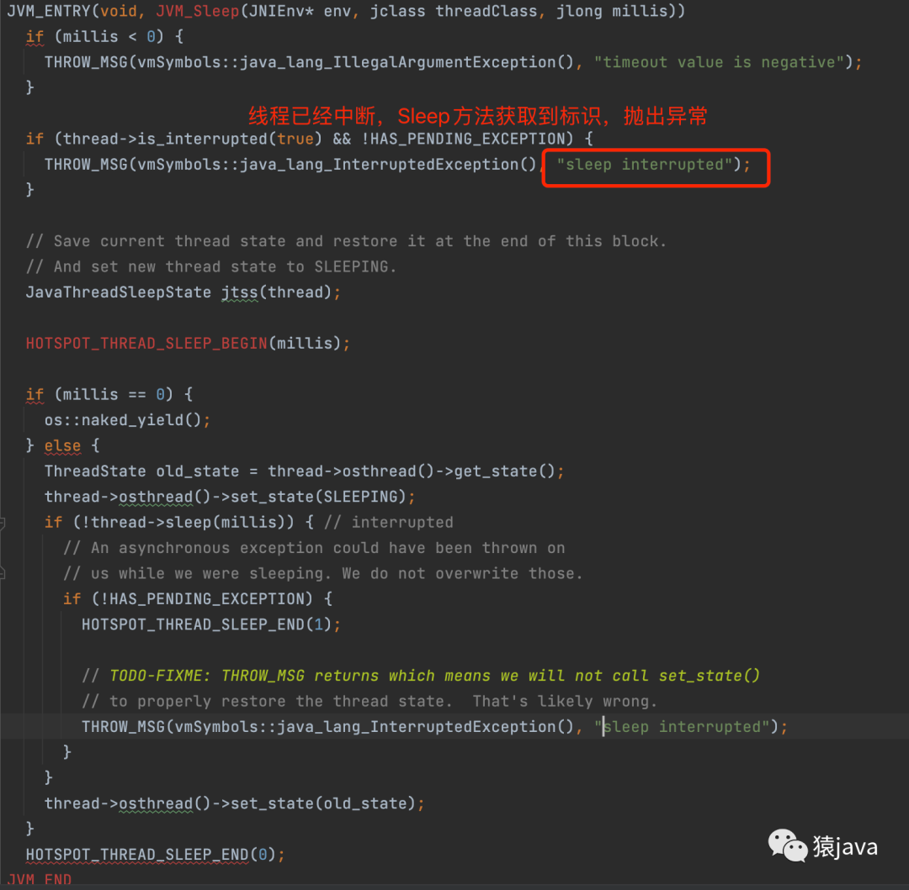

你好，我是猿java，一个践行终身学习的程序员。

在 Java19之前，线程是 Java运行的最小单元，线程作为 Java的核心功能之一，在 Java的发展史上起着举足轻重的作用，因此，今天我们就来聊聊
Java线程的相关知识。

> 申明：本文基于 jdk-11.0.15，操作系统基于 Linux，JVM
> 基于hotspot源码，[hotspot 源码下载地址](https://github.com/openjdk/jdk)

本文会从 线程定义、线程创建、线程状态、线程工作原理、线程组、线程优先级、线程通信 7个部分对线程进行全面分析。

## 什么是线程

维基百科中文版对线程的解释如下：


通过维基百科的描述，我们可以知道线程是操作系统执行的最小单元，一条线程指的是进程中一个单一顺序的控制流，一个进程中可以并发多个线程，每条线程并行执行不同的任务。在Unix
System V及SunOS中也被称为轻量进程（lightweight processes），但轻量进程更多指内核线程（kernel thread），而把用户线程（user
thread）称为线程。

在Java中，线程对应的是 java.lang.Thread类，下图为 Thread的源码描述：


因此，在 Java中，线程是指程序中的执行线程，每个线程都有一个优先级，高优先级的线程执行要优先于低优先级线程，在
Java虚拟机中，允许应用程序同时运行多个执行线程，当 JVM启动时，通常会维护一个 非守护线程（main方法对应的线程）。

## 线程创建方式

在 Java中，创建线程有 3种方式：继承 Thread类、实现 Runnable接口、Callable/Future。

### 继承 Thread类

创建线程的第一种方法是将类声明为 Thread的子类。该子类需要重写 Thread类的 run()方法，然后创建子类的实例，最后调用实例的
start()方法启动线程。示例代码如下：

```java
public class MyThread extends Thread {

  @Override
  public void run() {
    System.out.println("MyThread extends Thread!");
  }

  public static void main(String[] args) {
    MyThread thread = new MyThread();
    thread.start();
  }
}
```

代码执行结果如下：

```text
MyThread extends Thread!
```

### 实现 Runnable接口

创建线程的第二种方法是声明一个实现 Runnable接口的类。然后在类中实现 run()
方法，并且将该类的实例作为参数传递给一个线程类，最后，调用Thread.start()启动。示例代码如下：

```java
public class MyRunnable implements Runnable {

  @Override
  public void run() {
    System.out.println("MyRunnable implements Runnable!");
  }

  public static void main(String[] args) {
    MyRunnable runnable = new MyRunnable();
    Thread thread = new Thread(runnable);
    thread.start();
  }
}
```

代码执行结果如下：

```text
MyRunnable implements Runnable!
```

### Callable/Future

创建线程的第三种方法是实现 Callable接口，然后通过 Future获取结果值。一般来说 Callable需要配合线程池工具类
ExecutorService来使用，如下代码，定义一个 MyTask类，然后让该类去实现 Callable接口，并且实现 call()方法，最后通过
executor.submit()提交任务。

```java
public class MyThread implements Callable {

  @Override
  public Object call() throws Exception {

    return "MyThread implements Callable";
  }

  public static void main(String[] args) throws Exception {

    ExecutorService executor = Executors.newCachedThreadPool();
    MyTask task = new MyTask();
    Future<Integer> future = executor.submit(task);
    // get()方法会阻塞当前线程，直到得到结果。
    System.out.println(future.get());
  }
}
```

代码执行结果如下：

```text
MyThread implements Callable!
```

我们可以看看 Callable的源码：


通过 Callable的源码，我们可以得知 Callable是一个函数式接口，并且只有一个 call() 抽象方法，Callable 接口与 Runnable
类似。 不过，Runnable不返回结果，也不能抛出检查异常。

我们再看下 Future.get()是如何获取数据的


通过源码可以看出，get()是一个阻塞方法，等待直到处理完成返回结果或者等待超时。

**Thread、Runnable、Callable/Future 比较**

- 由于 Java是单继承，因此 Runnable接口比 Thread更灵活；
- Runnable接口更符合面向对象编程；
- Thread类的方法比较丰富，本身也实现了 Runnable接口，而 Runnable接口更为轻量；
- Thread、Runnable 都无法返回值，Callable/Future 可以拿到线程执行的结果值；
- Future.get()是阻塞方法来获取结果值；

## 线程的状态

在 Java中，线程的状态，也叫线程生命周期，主要有 6种，其源码如下：

```java
public class Thread implements Runnable {
  public enum State {
    NEW,
    RUNNABLE,
    BLOCKED,
    WAITING,
    TIMED_WAITING,
    TERMINATED;
  }
}
```

### NEW

NEW：尚未启动的线程处于此状态，我们可以通过下面的代码来验证 NEW：

```java
@Test
public void testStateNew(){
  Thread thread=new Thread(()->{});
  System.out.println(thread.getState()); // 输出 NEW
  }
```

### RUNNABLE

RUNNABLE：处于 RUNNABLE(可运行)状态的线程在 Java虚拟机中执行，但它可能正在等待来自操作系统的其他资源，例如处理器。我们可以通过下面的代码来验证
RUNNABLE：

```java
@Test
public void testStateNew(){
  // 只创建一个线程，并没有调用 start()方法
  Thread thread=new Thread(()->{});
  thread.start();
  System.out.println(thread.getState()); // 输出 RUNNABLE
  }
```

### BLOCKED

BLOCKED：处于阻塞状态的线程正在等待监视器锁进入同步块/方法或调用 Object.wait 后重新进入同步块/方法。

### WAITING

WAITING：等待状态。 调用以下方法，线程就会处于等待状态：

- Object.wait()
- Thread.join()
- LockSupport.park()

处于 WAITING等待状态的线程，需要其他线程对其对象执行下面任一方法才能切换成 RUNNABLE状态：

- notify()
- notifyAll()
- LockSupport.unpark()

### TIMED_WAITING

TIMED_WAITING：超时等待状态。线程等待给定的时间后会被自动唤醒。
调用以下方法会使线程进入超时等待状态：

- Thread.sleep(long millis)：使当前线程睡眠指定时间；
- Object.wait(long timeout)：线程休眠指定时间，等待期间可以通过notify()/notifyAll()唤醒；
- Thread.join(long millis)：等待当前线程最多执行millis毫秒，如果millis为0，则会一直执行；
- LockSupport.parkNanos(long nanos)： 除非获得调用许可，否则禁用当前线程进行线程调度指定时间；
- LockSupport.parkUntil(long deadline)：同上，也是禁止线程进行调度指定时间；

我们通过下面的代码来验证状态：

```java
public class ThreadBlocked extends Thread {
  @Override
  public void run() {
    while (true) {
      try {
        // 线程进入 TIMED_WAITING 状态
        TimeUnit.SECONDS.sleep(100);
      } catch (InterruptedException e) {
        e.printStackTrace();
      }
    }
  }

  public static void main(String[] args) {
    Thread threadBlocked = new Thread(new ThreadBlocked(), "ThreadBlocked");
    threadBlocked.start();
  }
}
```

在上述代码中，让线程 sleep睡眠 100s，然后可以通过 jstack pid指令查看堆栈信息，从而观测线程状态：


### TERMINATED

TERMINATED：已终止状态，代表线程已完成执行。

通过上文的分析，我们可以把 6种状态及其转换关系总结如下图：


## 线程的工作原理

### 启动线程

在上述创建线程的示例中，我们通过 Thread.start()方法就能执行线程，那么 start()是如何实现的呢？


通过 Runnable源码可以看出，Runnable是一个函数式接口，内部只有一个抽象方法 run()，任何实现该接口的线程类都必须实现 run()
方法，而 Thread源码显示，Thread本身实现了 Runnable接口，Thread.start()最终调用本地方法 native start0()，也就是说 start0()
方法是在 JVM中实现的，因此继续查阅 JVM的源码，看看 start0()方法到底做了什么。

从 Thread.c源码可以看出，start0()会映射到 JVM中的 JVM_StartThread方法。


在 jvm.cpp源码中，JVM_StartThread方法实现逻辑为：

1. 判断 Java线程是否已经启动，如果启动过，则抛异常，所以 start()不能重复调用；
2. 如果 Java线程没有启动过，则通过 new JavaThread()创建 Java线程；
3. 调用 Thread::start(native_thread); 启动步骤2创建的线程；


在 javaThread.cpp源码中，new JavaThread()创建线程是通过 os::create_thread(this, thr_type, stack_sz)方法，创建
Java线程对应的内核线程。因此需要进入 os::create_thread()方法


在 os_linux.cpp源码中，os::create_thread() 是利用 pthread_create()来创建线程，共4个参数，第三个参数
thread_native_entry便是新线程运行的初始地址（定义在 os_bsd.cpp中的一个方法指针），第四个参数 thread即thread_native_entry的参数：


到处，线程已经创建完成，接下来就是启动线程，调用 Thread::start(native_thread)，start()方法会调用平台启动线程的方法: os::
start_thread(thread);，最终会调用 thread.cpp文件中的 JavaThread::run()方法


在 thread.cpp源码中，thread->call_run() 调用了 thread_main_inner()。


在 javaThread.cpp源码中，thread_main_inner()方法中的 this->entry_point(this, this)返回的其实就是在 new JavaThread(
&thread_entry, sz) 时传入的 thread_entry。因此，thread_main_inner()就相当于调用了thread_entry(this，this)。


在 jvm.cpp源码中，thread_entry方法中，JVM通过 JavaCall模块调用了 Java中的 run()方法。


通过上面对 JDK和 JVM的源码分析，我们可以把 Thread.start()的整个执行过程整理成下图：


那么，线程是如何停止的呢？

### 停止线程

想必大家很自然就会想到 Thread.stop()或者 Thread.suspend()，不过，很遗憾的是，Thread.stop() 和 Thread.suspend() 从JDK
1.2就已经被废弃了，主要是因为方法本质上是不安全的，使用它来停止线程会导致所有已锁定的监视器都被解锁，因此推荐使用
Thread.interrupt()来中断线程。

interrupt()方法两个重要作用：

- 设置一个线程终止的标记（共享变量的值 true）

- 唤醒处于阻塞状态下的线程

如下代码，线程睡眠300s，然后在线程睡眠过程中调用 Thread.interrupt()方法，试图去中断线程

```java
public class MyThread extends Thread {
  public static void main(String[] args) {
    MyThread thread = new MyThread();
    thread.start();
    // 调用interrupt
    thread.interrupt();
  }

  @Override
  public void run() {
    try {
      TimeUnit.SECONDS.sleep(300);

    } catch (InterruptedException e) {
      e.printStackTrace();
    }
  }
}
```

执行上述代码，可以发现线程被正常中断，catch中会打印出以下堆栈信息：java.lang.InterruptedException: sleep interrupted

那么，Thread.interrupt() 是如何中断线程的？

我们从 Thread.interrupt() 进行分析，发现 interrupt()调用了 native interrupt0()，从而转向了 JVM的实现，interrupt()源码如下：


在 JVM 的 Thread.c 源码中，我们可以看到 interrupt0()映射到 JVM_Interrupt方法，源码截图如下：


接着我们进入 JVM_Interrupt 方法的源码类jvm.cpp， 在 JVM_Interrupt中会判断线程是否存活，如果存活，才会调用 JavaThread.interrupt()方法进行线程中断操作，否则直接结束方法，源码截图如下：


最后，我们进入 javaThread.cpp ，interrupt() 方法针对线程不同的状态，会采取相应的方法来进行中断，具体实现逻辑如下图：


为什么interrupt()方法需要使用 unpark()呢？这是因为在演示代码中使用的是Thread.sleep()方法进行线程睡眠，而 sleep()最终会调用park 函数，源码截图如下：


所以 interrupt()需要使用unpark()唤醒睡眠的线程，park()方法其实是调用系统层面的锁挂起线程，而unpark()方法调用系统层面的唤醒条件变量达到唤醒线程的目的，Sleep()方法检测到线程中断标识，抛出 sleep interrupted异常。



### start() 和 run() 的比较

```java
public class MyThread extends Thread {

  @Override
  public void run() {
    System.out.println("ThreadName:" + Thread.currentThread().getName());
  }

  public static void main(String[] args) {
    MyThread thread = new MyThread();
    thread.run();   // 输出 ThreadName:main
    thread.run();   // 输出 ThreadName:main
    thread.start(); // 输出 ThreadName:Thread-0
    thread.start(); // 抛出 java.lang.IllegalThreadStateException 异常
  }
}
```
通过上面的执行结果我们可以得出：
- start(): 会启动一个新线程，新线程会执行相应的 run()方法；不能被重复调用，JVM源码会判断线程是否已经启动过。
- run() : 直接调用实例的 run()方法，此时 run()就是一个普通方法，不会启动一个新线程，而是直接在当前线程中执行；可重复调用。


**Thread 其他一些重要方法**

| 方法                       | 说明                        |
|--------------------------|---------------------------|
| native void yield()      | 当前线程将放弃对处理器的使用，一般调试和测试中比较常用 |
| native void sleep()      | 线程睡眠指定的时长，线程不会释放对监视器的所有权  |
| void interrupt()         | 中断线程                      |
| void stop()              | 强制线程停止运行(从JDK1.2被废弃)      |
| synchronized void join() | 最多等待指定毫秒后让线程终止。 0 意味着永远等待。 |
| void setDaemon() | 用将线程设置为守护线程或用户线程，需在线程启动前设置 |

对照 JVM源码可以发现，在 Thread类中的很多方法最终都会映射到 JVM内部的 C++方法，甚至还需要和 OS操作系统进行交互。

### 总结

通过上文对线程运行原理的解析，我们可以总结：

- 线程是由操作系统创建并调度的资源，然后通过 JavaCalls模块，最终回调 Java线程类的 run()方法，实现业务逻辑；
- 操作系统调度线程需要获取 CPU等资源，因此线程切换会耗费 CPU时间；
- Java线程类中的很多方法最终都是直接映射成JVM的C++方法，最终到操作系统内核方法；


## Java线程组

ThreadGroup：线程组，在 Java中，每个线程必须属于一个组，不能独立存在，如果在 new Thread()时没有显式指定线程组，那么默认将父线程（当前执行new
Thread()的线程）线程组设置为自己的线程组。public static void main(String[] args)方法的线程组默认为 main。

我们以一个实例来感受下线程组，如下代码，定义一个线程类，然后获取线程对应的线程组名称。

```java
public class MyThread extends Thread {

  @Override
  public void run() {
    System.out.println("MyThread extends Thread!");
  }

  public static void main(String[] args) {
    MyThread thread = new MyThread();
    thread.start();
    // 输出 threadGroup:main
    System.out.println("threadGroup:" + thread.getThreadGroup().getName());
  }
}
```

上述示例，我们并没有给线程示例设置过线程组，那么，线程组是在什么时候设置的呢？

我们先看看 Thread类在创建线程实例时做了什么，源码如下：

```java
public class Thread implements Runnable {

  // 无参构造器 创建线程
  public Thread() {
    this(null, null, "Thread-" + nextThreadNum(), 0);
  }

  // 指定线程组，Runnable和线程名来 创建线程
  public Thread(ThreadGroup group, Runnable target, String name, long stackSize) {
    this(group, target, name, stackSize, null, true);
  }

  // 最底层线程创建逻辑
  private Thread(ThreadGroup g, Runnable target, String name,
                 long stackSize, AccessControlContext acc,
                 boolean inheritThreadLocals) {
    if (name == null) {
      throw new NullPointerException("name cannot be null");
    }

    this.name = name;

    Thread parent = currentThread();
    SecurityManager security = System.getSecurityManager();
    if (g == null) {
      /* Determine if it's an applet or not */

            /* If there is a security manager, ask the security manager
               what to do. */
      if (security != null) {
        g = security.getThreadGroup();
      }

            /* If the security manager doesn't have a strong opinion
               on the matter, use the parent thread group.
              如果当前线程没有设置组，则获取父线程的线程组
               */
      if (g == null) {
        g = parent.getThreadGroup();
      }
      /* checkAccess regardless of whether or not threadgroup is
           explicitly passed in. */
      g.checkAccess();

      /*
       * Do we have the required permissions?
       */
      if (security != null) {
        if (isCCLOverridden(getClass())) {
          security.checkPermission(
            SecurityConstants.SUBCLASS_IMPLEMENTATION_PERMISSION);
        }
      }

      g.addUnstarted();

      this.group = g;
      this.daemon = parent.isDaemon();
      this.priority = parent.getPriority();
      if (security == null || isCCLOverridden(parent.getClass()))
        this.contextClassLoader = parent.getContextClassLoader();
      else
        this.contextClassLoader = parent.contextClassLoader;
      this.inheritedAccessControlContext =
        acc != null ? acc : AccessController.getContext();
      this.target = target;
      setPriority(priority);
      if (inheritThreadLocals && parent.inheritableThreadLocals != null)
        this.inheritableThreadLocals =
          ThreadLocal.createInheritedMap(parent.inheritableThreadLocals);
      /* Stash the specified stack size in case the VM cares */
      this.stackSize = stackSize;

      /* Set thread ID */
      this.tid = nextThreadID();
    }
  }
}
```

通过Thread源码可以看出，如果创建线程时未指定线程组，那么会采用父类的线层组，接着就来看下 ThreadGroup线程组源码类：


通过源码的描述可以得知：ThreadGroup（线程组）简单来说就是线程的集合，它是一个树形结构，并呈父子关系，除了
system线程组（只有子线程组），一个线程组既可以有父线程组，同时也可以有子线程组。但是，线程只能访问本线程组的信息，不能访问其父类或者其他线程组的信息。在
Java中线程组的树状结构如下图：


- system线程组，它是用来处理 JVM系统任务的线程组，比如对象销毁等；
- main线程组，它是 system线程组的直接子线程组，这个线程组至少包含一个main线程，用于执行main方法；
- sub线程组，它是 main线程组的子线程组，是应用程序创建的线程组；

所以，ThreadGroup线程组是一个标准的向下引用的树状结构，这样设计的目的是防止"上级"线程被"下级"线程引用而无法有效地被 GC回收。

ThreadGroup其他一些重要方法：

| 方法                                  | 说明                         |
|-------------------------------------|----------------------------|
| void checkAccess()                  | 判断线程能否访问该线程组               |
| int activeCount()                   | 返回线程组及其子组中活动线程数的估计值        |
| void destroy()                      | 销毁线程组及子线程组                 |
| void interrupt()                    | 中断线程组中所有线程                 |
| void stop() | 停止线程组中所有线程                 |
| void suspend()                                  | 挂起线程组中的所有线程                |
| ThreadLocal.ThreadLocalMap threadLocals     | 存放线程变量副本，和 ThreadLocal配合使用 |

## Java线程优先级

在 Thread类中，关于线程优先级的源码如下，通过源码可以看出，线程的优先级在 1~10，Java 默认的线程优先级为 5，可以通过
setPriority()进行优先级的设置，通常情况下，高优先级的线程会比低优先级的线程更优先执行，但是最终执行的顺序还是由操作系统的调度器来决定。
所以说，Java中的线程的优先级来是一个参考值，它只是给操作系统一个建议，最终的调用顺序，是由操作系统的线程调度算法决定的。

```java
public class Thread implements Runnable {
  private int priority;
  /**
   * The minimum priority that a thread can have.
   */
  public static final int MIN_PRIORITY = 1;

  /**
   * The default priority that is assigned to a thread.
   */
  public static final int NORM_PRIORITY = 5;

  /**
   * The maximum priority that a thread can have.
   */
  public static final int MAX_PRIORITY = 10;
}
```

上文我们讲述了 Thread工作机制，线程组等相关知识，那么，线程作为 Java19之前的最小运行单元，他们之间是如何通信的呢？

## Java线程通信

Java中线程间通信的方式主要有 2种：共享内存 和 消息传递。

### 共享内存

线程之间共享程序的公共状态，线程之间通过写-读内存中的公共状态来隐式进行通信，比如：volatile和 synchronized关键字。

volatile关键字保证了共享变量的可见性，也就是说，任何线程更新了主内存，其他线程就必须失效本地工作内存，然后从主内存中获取最新值同步到自己的工作内存，这样线程之间通过共享内存实现通信。

synchronized关键字通过向对象施加 Monitor锁，从而确保同一时间只能有一个线程能拿到锁，保证了线程访问的可见性和排他性。

### 消息传递

线程之间通过明确的发送消息来显式进行通信，在 Java中典型的消息传递方式就是 wait()、notify()、notifyAll()。

当线程A 调用了对象 Object的 wait()方法后，会释放 Object的 monitor所有权，然后进入等待状态，当另外一个线程B调用了同一个对象的
notify()或者notifyAll()方法，线程A 收到通知后会继续抢占运行需要的资源，因此，线程A，B就通过消息传递的方式实现了通信。

## 总结

到此，我们对线程进行了全面的分析，线程是 Java中非常核心，也很容易被忽略的一个知识点，它更是多线程的一个基础，如果你有充足的时间，可以下载
JVM源码，对照本文给的源码查看线索，
从 JVM和操作系统的角度去了解线程的运行机制，相信投人了就一定会受益匪浅。

## 鸣谢

文章总结不易，如果你觉得本文章对你有帮助，感谢转发给更多的好友，关注我：猿java，为你呈现更多的硬核文章。


